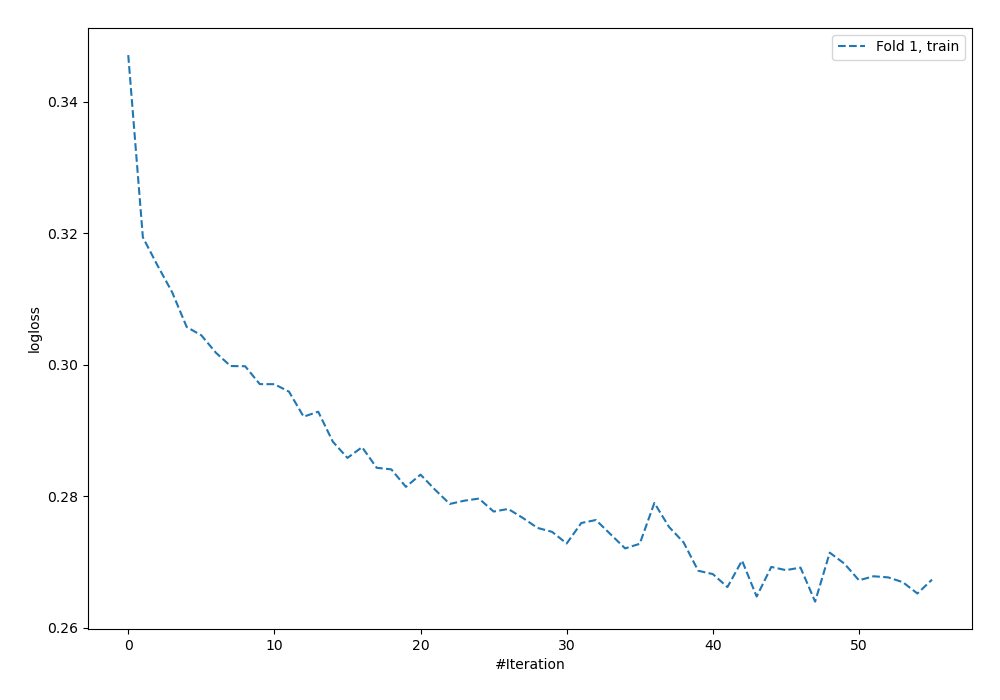
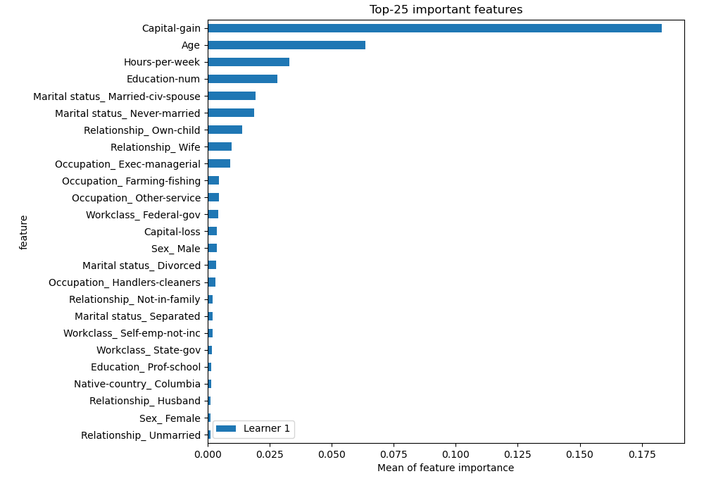
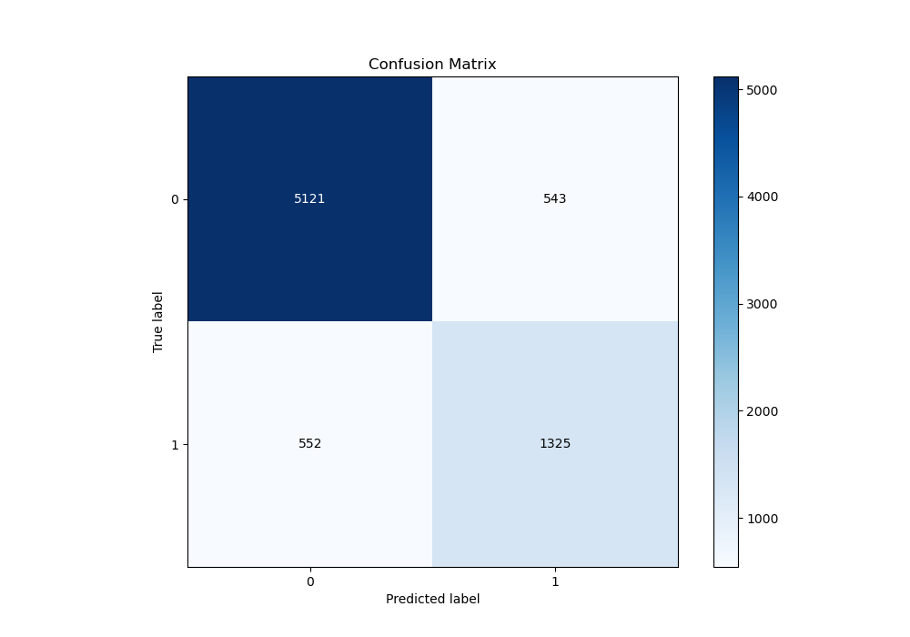
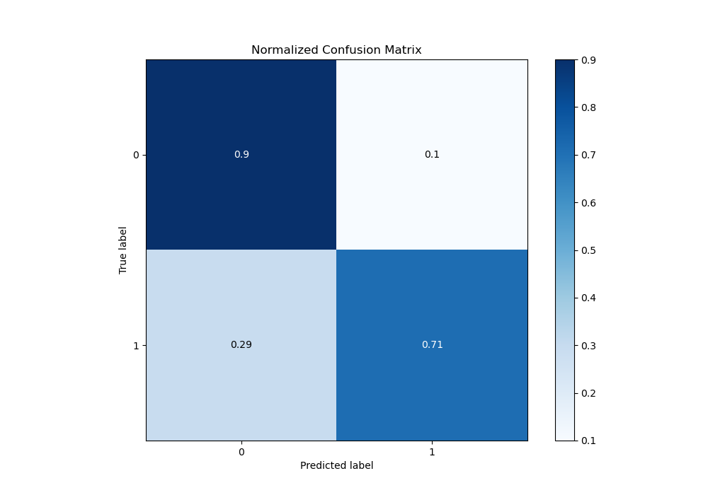
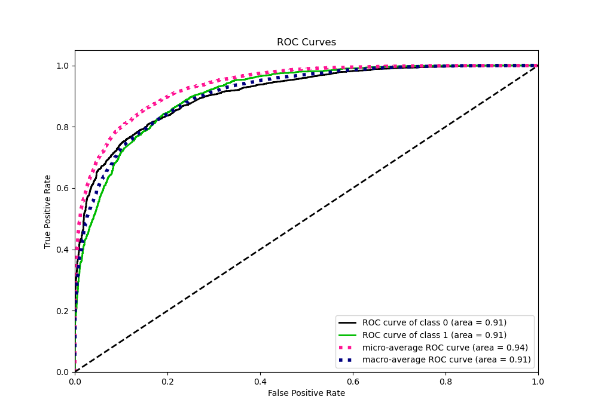
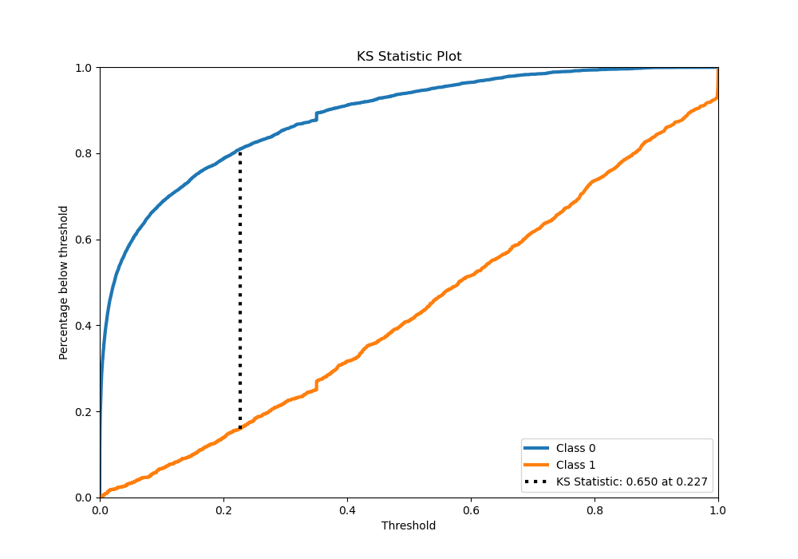
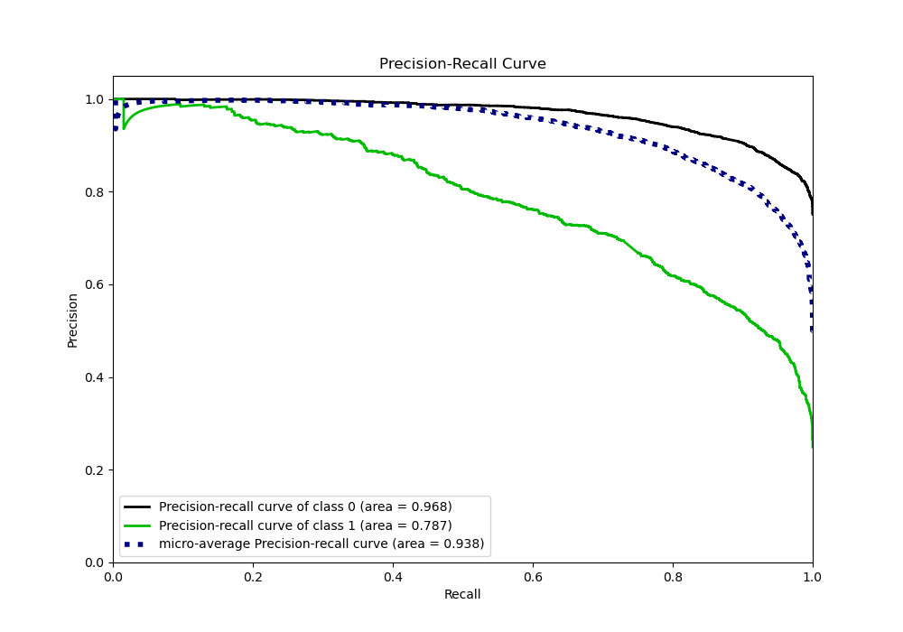
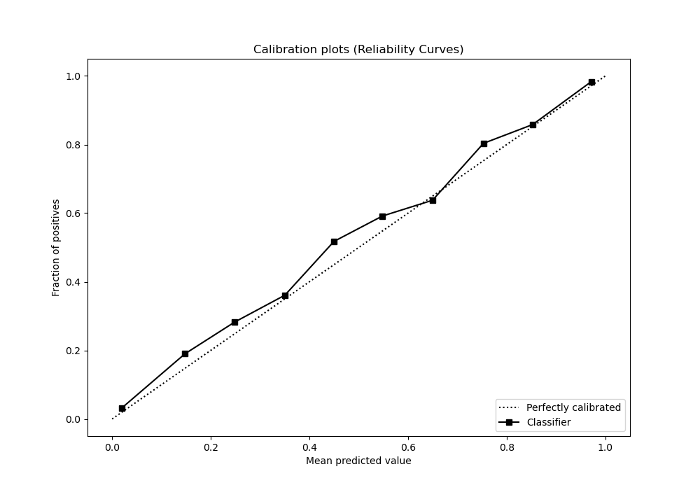
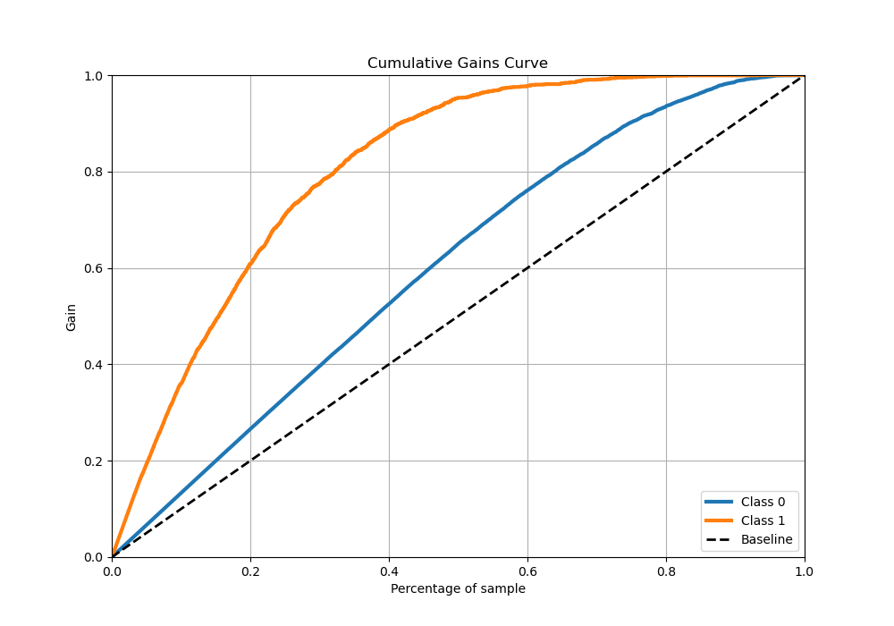
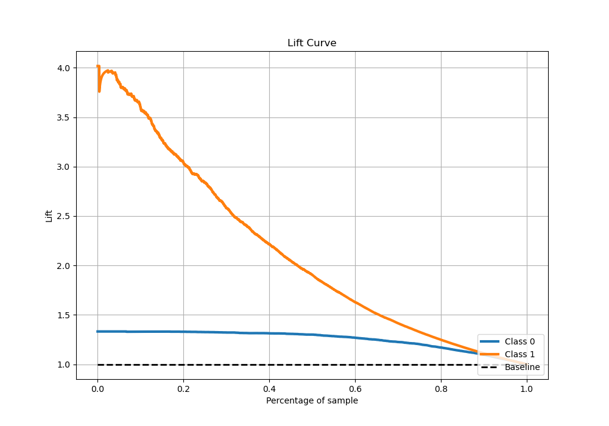

# Summary of 4_Default_NeuralNetwork

[<< Go back](../README.md)

## Neural Network
- **n_jobs**: -1
- **dense_1_size**: 32
- **dense_2_size**: 16
- **learning_rate**: 0.05
- **explain_level**: 2

## Validation
 - **validation_type**: split
 - **train_ratio**: 0.75
 - **shuffle**: True
 - **stratify**: True

## Optimized metric
logloss

## Training time

15.4 seconds

## Metric details
|           |    score |     threshold |
|:----------|---------:|--------------:|
| logloss   | 0.322774 | nan           |
| auc       | 0.909976 | nan           |
| f1        | 0.710526 |   0.365528    |
| accuracy  | 0.854794 |   0.379148    |
| precision | 0.953964 |   0.866467    |
| recall    | 1        |   5.34111e-08 |
| mcc       | 0.613125 |   0.365528    |

## Metric details with threshold from accuracy metric
|           |    score |   threshold |
|:----------|---------:|------------:|
| logloss   | 0.322774 |  nan        |
| auc       | 0.909976 |  nan        |
| f1        | 0.70761  |    0.379148 |
| accuracy  | 0.854794 |    0.379148 |
| precision | 0.709315 |    0.379148 |
| recall    | 0.705914 |    0.379148 |
| mcc       | 0.611028 |    0.379148 |

## Confusion matrix (at threshold=0.379148)
|              |   Predicted as 0 |   Predicted as 1 |
|:-------------|-----------------:|-----------------:|
| Labeled as 0 |             5121 |              543 |
| Labeled as 1 |              552 |             1325 |

## Learning curves

## Permutation-based Importance

## Confusion Matrix

## Normalized Confusion Matrix

## ROC Curve

## Kolmogorov-Smirnov Statistic

## Precision-Recall Curve

## Calibration Curve

## Cumulative Gains Curve

## Lift Curve

[<< Go back](../README.md)
