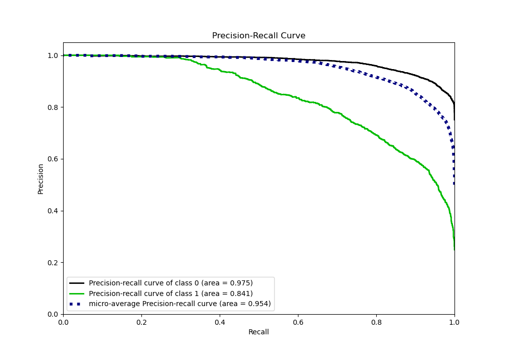
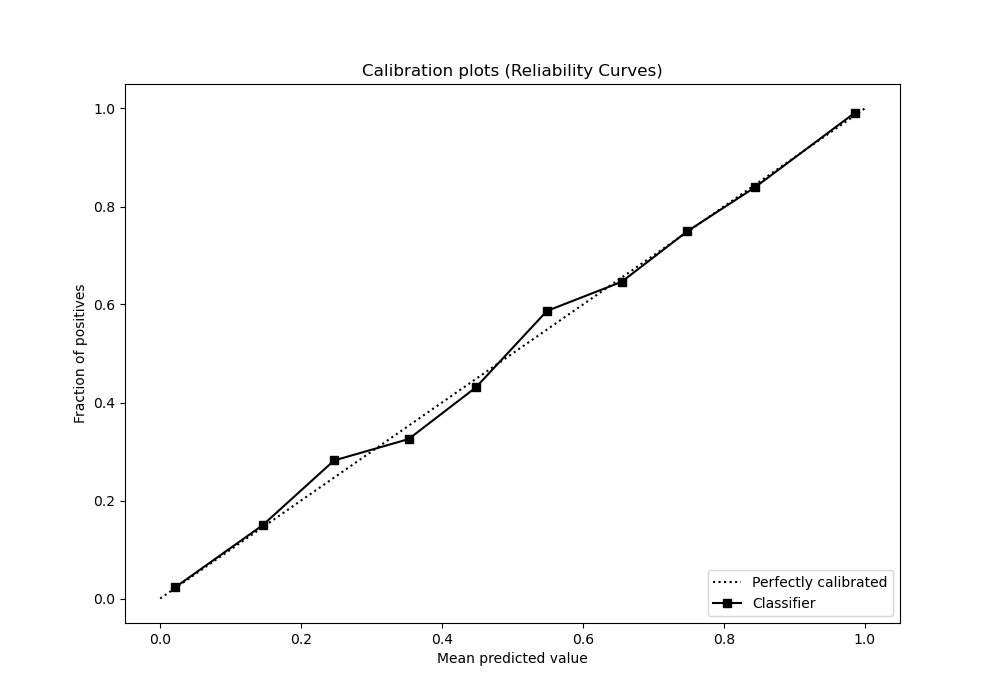

# Summary of Ensemble

[<< Go back](../README.md)

## Ensemble structure
| Model             |   Weight |
|:------------------|---------:|
| 3_Default_Xgboost |        5 |

## Metric details
|           |    score |     threshold |
|:----------|---------:|--------------:|
| logloss   | 0.278105 | nan           |
| auc       | 0.930486 | nan           |
| f1        | 0.744648 |   0.377797    |
| accuracy  | 0.876674 |   0.500199    |
| precision | 0.99031  |   0.919127    |
| recall    | 1        |   1.08485e-05 |
| mcc       | 0.658934 |   0.470716    |

## Metric details with threshold from accuracy metric
|           |    score |   threshold |
|:----------|---------:|------------:|
| logloss   | 0.278105 |  nan        |
| auc       | 0.930486 |  nan        |
| f1        | 0.732759 |    0.500199 |
| accuracy  | 0.876674 |    0.500199 |
| precision | 0.795384 |    0.500199 |
| recall    | 0.679275 |    0.500199 |
| mcc       | 0.656681 |    0.500199 |

## Confusion matrix (at threshold=0.500199)
|              |   Predicted as 0 |   Predicted as 1 |
|:-------------|-----------------:|-----------------:|
| Labeled as 0 |             5336 |              328 |
| Labeled as 1 |              602 |             1275 |

## Learning curves

## Confusion Matrix

## Normalized Confusion Matrix

## ROC Curve

## Kolmogorov-Smirnov Statistic

## Precision-Recall Curve

## Calibration Curve

## Cumulative Gains Curve

## Lift Curve

[<< Go back](../README.md)
