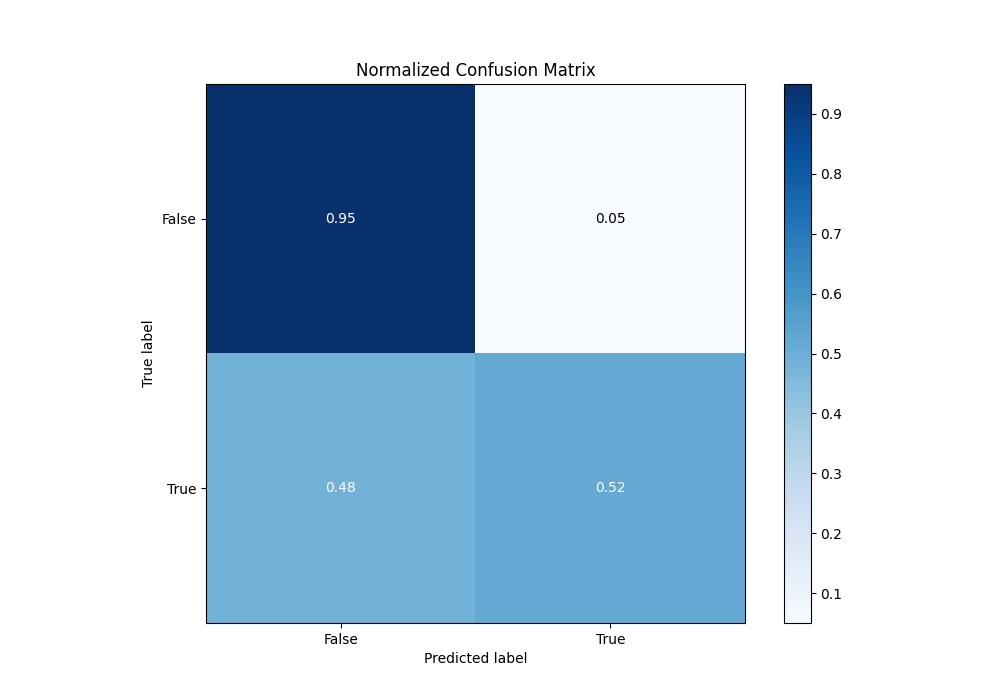
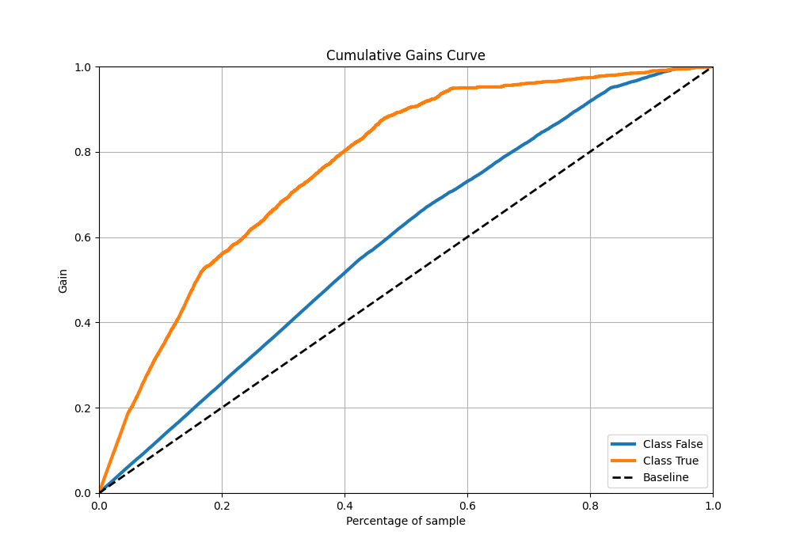

# Summary of 2_DecisionTree

[<< Go back](../README.md)

## Decision Tree
- **n_jobs**: -1
- **criterion**: gini
- **max_depth**: 3
- **explain_level**: 2

## Validation
 - **validation_type**: split
 - **train_ratio**: 0.75
 - **shuffle**: True
 - **stratify**: True

## Optimized metric
logloss

## Training time

13.1 seconds

## Metric details
|           |    score |   threshold |
|:----------|---------:|------------:|
| logloss   | 0.365743 | nan         |
| auc       | 0.858619 | nan         |
| f1        | 0.620205 |   0.304623  |
| accuracy  | 0.842461 |   0.304623  |
| precision | 0.994186 |   0.982143  |
| recall    | 1        |   0.0223728 |
| mcc       | 0.543019 |   0.304623  |

## Metric details with threshold from accuracy metric
|           |    score |   threshold |
|:----------|---------:|------------:|
| logloss   | 0.365743 |  nan        |
| auc       | 0.858619 |  nan        |
| f1        | 0.620205 |    0.304623 |
| accuracy  | 0.842461 |    0.304623 |
| precision | 0.77538  |    0.304623 |
| recall    | 0.516782 |    0.304623 |
| mcc       | 0.543019 |    0.304623 |

## Confusion matrix (at threshold=0.304623)
|              |   Predicted as 0 |   Predicted as 1 |
|:-------------|-----------------:|-----------------:|
| Labeled as 0 |             5383 |              281 |
| Labeled as 1 |              907 |              970 |

## Learning curves

## Decision Tree 

### Tree #1

### Rules

if (Marital status_ Married-civ-spouse <= 0.5) and (Capital-gain <= 7073.5) and (Education-num <= 12.5) then class: 0 (proba: 97.51%) | based on 9,373 samples

if (Marital status_ Married-civ-spouse > 0.5) and (Education-num <= 12.5) and (Capital-gain <= 5095.5) then class: 0 (proba: 69.54%) | based on 7,117 samples

if (Marital status_ Married-civ-spouse > 0.5) and (Education-num > 12.5) and (Capital-gain <= 5095.5) then class: 1 (proba: 67.91%) | based on 2,649 samples

if (Marital status_ Married-civ-spouse <= 0.5) and (Capital-gain <= 7073.5) and (Education-num > 12.5) then class: 0 (proba: 84.86%) | based on 2,397 samples

if (Marital status_ Married-civ-spouse > 0.5) and (Education-num > 12.5) and (Capital-gain > 5095.5) then class: 1 (proba: 99.79%) | based on 468 samples

if (Marital status_ Married-civ-spouse > 0.5) and (Education-num <= 12.5) and (Capital-gain > 5095.5) then class: 1 (proba: 97.69%) | based on 390 samples

if (Marital status_ Married-civ-spouse <= 0.5) and (Capital-gain > 7073.5) and (Age > 20.5) then class: 1 (proba: 98.21%) | based on 224 samples

if (Marital status_ Married-civ-spouse <= 0.5) and (Capital-gain > 7073.5) and (Age <= 20.5) then class: 0 (proba: 100.0%) | based on 2 samples

## Permutation-based Importance

## Confusion Matrix

## Normalized Confusion Matrix

## ROC Curve

## Kolmogorov-Smirnov Statistic

## Precision-Recall Curve

## Calibration Curve

## Cumulative Gains Curve

## Lift Curve

## SHAP Importance

## SHAP Dependence plots

### Dependence (Fold 1)

## SHAP Decision plots

[<< Go back](../README.md)
