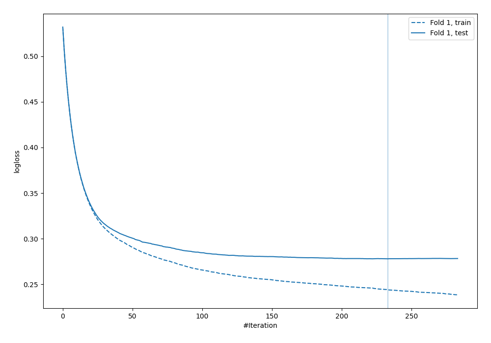

# Summary of 3_Default_Xgboost

[<< Go back](../README.md)

## Extreme Gradient Boosting (Xgboost)
- **n_jobs**: -1
- **objective**: binary:logistic
- **eta**: 0.075
- **max_depth**: 6
- **min_child_weight**: 1
- **subsample**: 1.0
- **colsample_bytree**: 1.0
- **eval_metric**: logloss
- **explain_level**: 2

## Validation
 - **validation_type**: split
 - **train_ratio**: 0.75
 - **shuffle**: True
 - **stratify**: True

## Optimized metric
logloss

## Training time

7.2 seconds

## Metric details
|           |    score |     threshold |
|:----------|---------:|--------------:|
| logloss   | 0.278057 | nan           |
| auc       | 0.930508 | nan           |
| f1        | 0.745307 |   0.369213    |
| accuracy  | 0.876276 |   0.464617    |
| precision | 1        |   0.996537    |
| recall    | 1        |   1.97124e-05 |
| mcc       | 0.659256 |   0.464617    |

## Metric details with threshold from accuracy metric
|           |    score |   threshold |
|:----------|---------:|------------:|
| logloss   | 0.278057 |  nan        |
| auc       | 0.930508 |  nan        |
| f1        | 0.738436 |    0.464617 |
| accuracy  | 0.876276 |    0.464617 |
| precision | 0.77929  |    0.464617 |
| recall    | 0.701652 |    0.464617 |
| mcc       | 0.659256 |    0.464617 |

## Confusion matrix (at threshold=0.464617)
|              |   Predicted as 0 |   Predicted as 1 |
|:-------------|-----------------:|-----------------:|
| Labeled as 0 |             5291 |              373 |
| Labeled as 1 |              560 |             1317 |

## Learning curves

## Permutation-based Importance

## Confusion Matrix

## Normalized Confusion Matrix

## ROC Curve

## Kolmogorov-Smirnov Statistic

## Precision-Recall Curve

## Calibration Curve

## Cumulative Gains Curve

## Lift Curve

## SHAP Importance

## SHAP Dependence plots

### Dependence (Fold 1)

## SHAP Decision plots

[<< Go back](../README.md)
